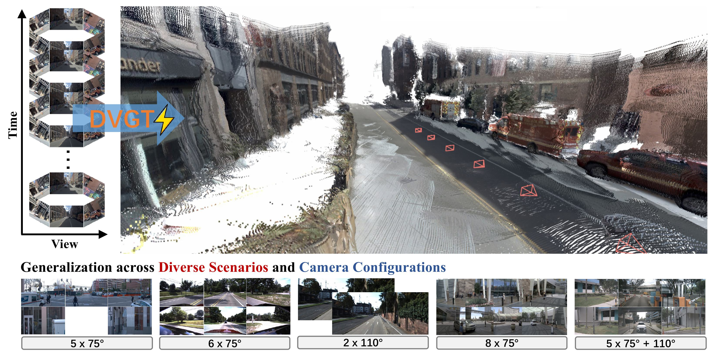

<div align="center">
<h1>DVGT: Driving Visual Geometry Transformer</h1>

<a href="https://arxiv.org/abs/2512.xxxxx"></a>
<a href="https://wzzheng.net/DVGT"></a>
<a href='https://huggingface.co/RainyNight/DVGT'></a>


>[Sicheng Zuo](https://zuosc19.github.io/)<sup>\*</sup>, [Zixun Xie](https://github.com/rainyNighti)<sup>\*</sup>, [Wenzhao Zheng](https://wzzheng.net/)<sup>*</sup>$\ddagger$,  Shaoqing Xu $\dagger$, Fang Li, Shengyin Jiang, Long chen, Zhi-Xin Yang, [Jiwen Lu](http://ivg.au.tsinghua.edu.cn/Jiwen_Lu/)
</div>

<sup>*</sup> Equal contributions. $\dagger$ Project leader.  $\ddagger$ Research advisor.

**DVGT**, a universal visual geometry transformer for autonomous driving, directly predicts metric-scaled global 3D point maps from a sequence of unposed multi-view images, eliminating the need for post-alignment with external data. 



## News
- **[2025/12/19]** We have released the paper, inference code, and visualization checkpoints.

## Demo
<p align="center">
<video src="./assets/demo.mp4" width="600px" controls autoplay loop muted>
</video>
</p>

## Overview

DVGT proposes a universal framework for driving geometry perception. Unlike conventional driving models that are tightly coupled to specific sensor setups or require ground-truth poses, our model leverages spatial-temporal attention to process unposed image sequences directly. By decoding global geometry in the ego-coordinate system, DVGT achieves metric-scaled dense reconstruction without LiDAR alignment, offering a robust solution that adapts seamlessly to diverse vehicles and camera configurations.

## Experimental Results
DVGT significantly outperforms existing models on various scenarios. **Quantitative comparison of 3D scene reconstruction.** Our method (red) demonstrates superior accuracy ($\delta < 1.25$ for ray depth estimation) across all evaluated datasets.

<p align="center">

</p>


## Quick Start

Firstly, clone this repository to your local machine, and install the dependencies (torch, torchvision, numpy, Pillow, and huggingface_hub). 
We tested the code with CUDA 12.8, python3.11 and torch 2.8.0.

```bash
git clone https://github.com/wzzheng/DVGT.git
cd dvgt

conda create -n dvgt python=3.11
conda activate dvgt

pip install -r requirements.txt
```

Secondly, download the pretrained checkpoint file from the [URL]() and save it to the ./ckpt directory.

Now, try the model with just a few lines of code:

```python
import torch
from dvgt.models.dvgt import DVGT
from dvgt.utils.load_fn import load_and_preprocess_images
from iopath.common.file_io import g_pathmgr

checkpoint_path = 'path to your checkpoint'

device = "cuda" if torch.cuda.is_available() else "cpu"
# bfloat16 is supported on Ampere GPUs (Compute Capability 8.0+) 
dtype = torch.bfloat16 if torch.cuda.get_device_capability()[0] >= 8 else torch.float16

# Initialize the model and load the pretrained weights.
model = DVGT()
with g_pathmgr.open(checkpoint_path, "rb") as f:
    checkpoint = torch.load(f, map_location="cpu")
model.load_state_dict(checkpoint)
model = model.to(device).eval()

# Load and preprocess example images (replace with your own image paths)
image_dir = 'examples/openscene_log-0104-scene-0007'
images = load_and_preprocess_images(image_dir, start_frame=16, end_frame=24).to(device)

with torch.no_grad():
    with torch.amp.autocast(device, dtype=dtype):
        # Predict attributes including cameras, depth maps, and point maps.
        predictions = model(images)
```

## Detailed Usage

<details>
<summary>Click to expand</summary>

You can also optionally choose which attributes (branches) to predict, as shown below. This achieves the same result as the example above. This example uses a batch size of 1 (processing a single scene), but it naturally works for multiple scenes.

```python
import torch
from dvgt.models.dvgt import DVGT
from dvgt.utils.load_fn import load_and_preprocess_images
from iopath.common.file_io import g_pathmgr
from dvgt.utils.pose_enc import pose_encoding_to_ego_pose
from dvgt.utils.geometry import convert_point_in_ego_0_to_ray_depth_in_ego_n

checkpoint_path = 'ckpt/open_ckpt.pt'

device = "cuda" if torch.cuda.is_available() else "cpu"
# bfloat16 is supported on Ampere GPUs (Compute Capability 8.0+) 
dtype = torch.bfloat16 if torch.cuda.get_device_capability()[0] >= 8 else torch.float16

# Initialize the model and load the pretrained weights.
model = DVGT()
with g_pathmgr.open(checkpoint_path, "rb") as f:
    checkpoint = torch.load(f, map_location="cpu")
model.load_state_dict(checkpoint)
model = model.to(device).eval()

# Load and preprocess example images (replace with your own image paths)
image_dir = 'examples/openscene_log-0104-scene-0007'
images = load_and_preprocess_images(image_dir, start_frame=16, end_frame=23).to(device)

with torch.no_grad():
    with torch.amp.autocast(device, dtype=dtype):
        aggregated_tokens_list, ps_idx = model.aggregator(images)
                
    # Predict ego n to ego first
    pose_enc = model.ego_pose_head(aggregated_tokens_list)[-1]
    # Ego pose following the OpenCV convention, relative to the ego-frame of the first time step.
    ego_n_to_ego_0 = pose_encoding_to_ego_pose(pose_enc)

    # Predict Point Maps in the ego-frame of the first time step
    point_map, point_conf = model.point_head(aggregated_tokens_list, images, ps_idx)

    # The predicted ray depth maps are originated from each ego-vehicle's position in its corresponding frame.
    ray_depth_in_ego_n = convert_point_in_ego_0_to_ray_depth_in_ego_n(point_map, ego_n_to_ego_0)    
```
</details>

## Visualization

Run the following command to perform reconstruction and visualize the point clouds in Viser. This script requires a path to an image folder formatted as follows:

    data_dir/
    ├── frame_0/ (contains view images, e.g., CAM_F.jpg, CAM_B.jpg...)
    ├── frame_1/
    ...

**Note on Data Requirements:**
1. **Consistency:** The data must be sampled at **2Hz**. All frames must contain the same number of views arranged in a fixed order.
2. **Capacity:** Inference supports up to **24 frames** with an arbitrary number of views per frame.

```bash
python demo_viser.py  --image_folder examples/openscene_log-0104-scene-0007
```

## Acknowledgements
Our code is based on the following brilliant repositories:

[Moge-2](https://github.com/microsoft/MoGe) 
[CUT3R](https://github.com/CUT3R/CUT3R) 
[Driv3R](https://github.com/Barrybarry-Smith/Driv3R) 
[VGGT](https://github.com/facebookresearch/vggt) 
[MapAnything](https://github.com/facebookresearch/map-anything) 
[Pi3](https://github.com/yyfz/Pi3)

Many thanks to these authors!

## TODO

- [x] Paper, inference code, and pre-trained weights (for visualization).
- [ ] Training suite: includes training code, evaluation scripts, and the data preparation pipeline.
- [ ] Dataset release: comprehensive datasets for training and testing.

## Citation

If you find this project helpful, please consider citing the following paper:
```
@article{zuo2025dvgt,
      title={DVGT: Driving Visual Geometry Transformer}, 
      author={Zuo, Sicheng and Xie, Zixun and Zheng, Wenzhao and Xu, Shaoqing and Li, Fang and Jiang, Shengyin and Chen, Long and Yang, Zhi-Xin and Lu, Jiwen},
      journal={arXiv preprint arXiv:2512.xxxxx},
      year={2025}
}
```